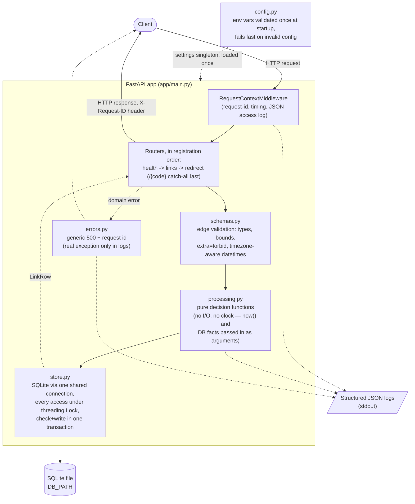
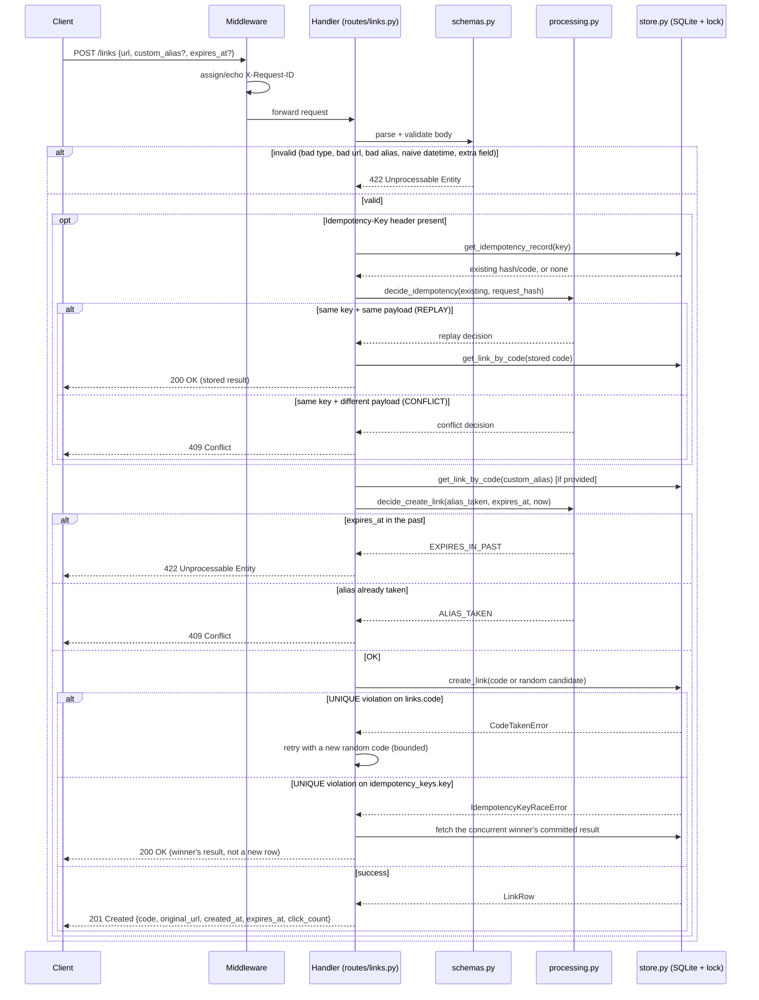
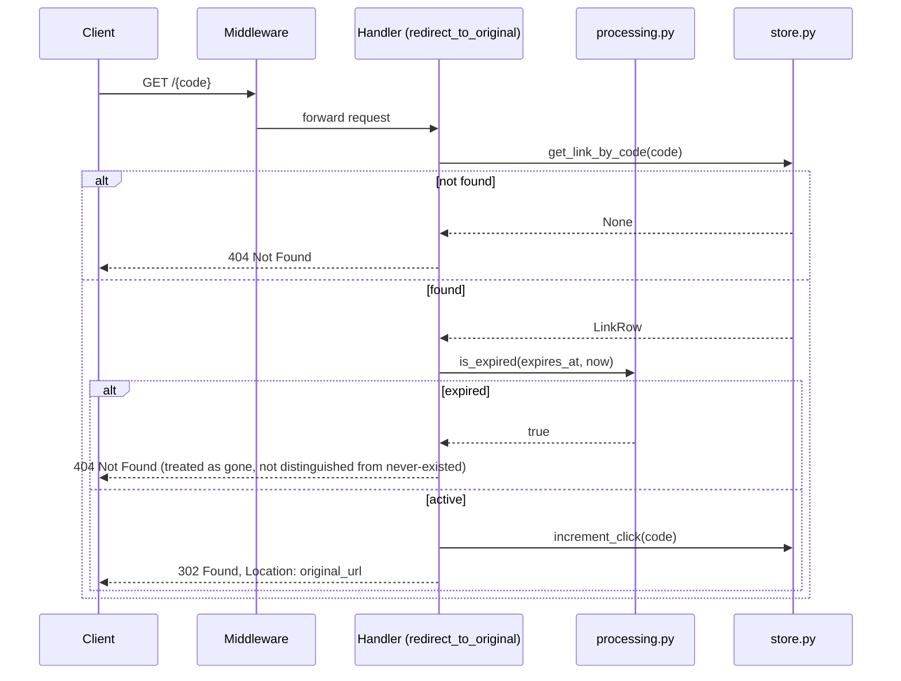

# Architecture

High-level view of the request lifecycle and data flow for the URL Shortener API.
See [README.md](README.md) for the full API spec, configuration, and design decisions.

## Component / data-flow overview

**What this shows**: every request passes through the same middleware (request-id + logging) regardless of outcome, then edge validation, then business rules, then persistence — each layer only depends on the one below it. `processing.py` never touches the database or the clock directly, which is what makes its decisions unit-testable in isolation (see `tests/test_processing.py`). Config is loaded exactly once at process startup and handed to every layer that needs it; nothing re-reads the environment mid-request.

## Request lifecycle: `POST /links`

**What this shows**: validation happens before any business rule is evaluated, business rules (alias/expiry) are evaluated before any write is attempted, and the two ways a concurrent write can fail (`CodeTakenError` vs `IdempotencyKeyRaceError`) are handled differently — one retries, the other fetches and returns the already-committed result instead of retrying something that can never succeed. This distinction was the fourth bug found during edge-case testing (see the "Decisions & trade-offs" section of the README).

## Request lifecycle: `GET /{code}` (redirect)

**What this shows**: the redirect is intentionally a `302` (not `301`) so every hit reaches this handler — that's what makes click counting and future expiry checks reliable, instead of a browser or CDN caching the redirect and skipping the server entirely.
